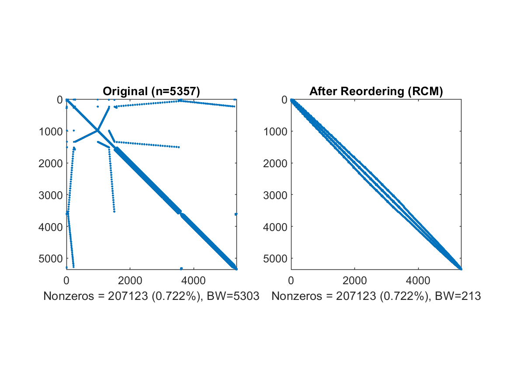

# Project Description

Sparse matrix reordering consists of swapping the matrix rows and columns in order to reduce the fill-in or/and the matrix bandwidth. The main benefits of reordering are calculation speed-up and memory storage reduction. Many algorithms can be used to reorder sparse matrices. In this project, I implemented few .m functions which allow to reorder a sparse matrix read from a [Matrix Market](https://math.nist.gov/MatrixMarket/) file using either the [Reverse Cuthill-McKee (RCM)](https://en.wikipedia.org/wiki/Cuthill%E2%80%93McKee_algorithm) or [Nested Dissection (ND)](https://en.wikipedia.org/wiki/Nested_dissection) algorithms. In addition to reordering, it is possible to write the reordered sparse matrix and the permutation vector to a Matrix Market file, plot it side-by-side with the original one, compute few statistics about both of them and output the plot as a PNG file. All these functions can be applied to a single input matrix or multiple matrices stored in a given folder. 

## Features

The implemented functions allow to:
* Read and write a sparse matrix in Matrix Market file format
* Reorder a sparse matrix using the Reverse Cuthill-McKee and the Nested Dissection algorithm
* Plot the original and reorderd matrices side-by-side
* Output statistics about both matrices (e.g., size, number of non-zeros, fill-in factor, bandwidth)
* Save the plot automatically as a PNG image
* Manipulate either single or multiple matrices (batch reordering)
* Save the permutation vector in Matrix Market file format

## Getting Started

The implemented functions can be used to reorder either a single matrix or multiple matrices.

### Single Matrix Reordering

To reorder a single matrix, the function `ReorderAndPrint` can be used as follows:

```Matlab
%% Funtion parameters:
%%	i_mtx_filename - input matrix market (MM) filename
%%	ofolder - the output folder
%%	algorithm - the reordering algorithm (i.e., ND or RCM)
%%	field - the type of the sparse matrix data (e.g., real, complex, etc.)
%%	precision - number of decimal digits to consider when writing the sparse matrix to a MM file
%%	save_permutation_vector - a flag indicating if the permutation vector should also be written to a MM file (this can be useful if a RHS vector should also be reordered)
%%	do_not_show - a flag indicating whether the matrix plot is shown on the screen
%%	do_not_print - a flag indicating whether the matrix plot is saved as a PNG image
%%	get_stats - a flag indicating whether the matrix statistics are computed
%%
ret = ReorderAndPrint(i_mtx_filename, ofolder, algorithm, field, precision, save_permutation_vector, do_not_show, do_not_print, get_stats);
```

### Multiple Matrices Reordering

The batch reordering mode can be useful if one needs to reorder several matrices simultaneously (large matrices can take significant time to be processed). For this purpose, the function `ReorderMMFromFolder` can be used to sequentially reorder all the matrices stored under a given folder. The reordered matrices are automatically stored under the folder `Output`, a child of the given folder. 

```Matlab
%% Specify the folder where the Matrix Market files are stored
folder = './data/nist';

%% Funtion parameters:
%% All the function parameters are the same as 'ReorderAndPrint' except folder which is the directory where all the MM files are stored

%% Invoke batch reordering function to process files one by one
ret = ReorderMMFromFolder(folder, algorithm, field, precision, save_permutation_vector, do_not_show, do_not_print, get_stats);
```

If required, the plots of each matrix and the permutation vectors are generated and saved to the `Output` folder.

## Examples

The folder [data](data/NIST) contains eighteen (18) symmetric matrices downloaded from the NIST official Matrix Market [website](https://math.nist.gov/MatrixMarket/). To test the behavior of the provided functions, one can proceed as follows:

### Single Matrix Reordering

Invoke the script in the file `reorder_single_file.m`. The output is similar to this:

```
Processing file: C:\Users\student\Documents\MATLAB\NewReordering\data\NIST\s3rmt3m3.mtx . . . . . . Done!
Matrix reordering using rcm took 2.427592 seconds.
Statistics:
	NNZ: 207123
	BW(perct): 3.484630e-06
	BW(in): 5303
	BW(out): 213

Saving permutation vector to file: data\NIST\Output\s3rmt3m3_p.mtx . . . . . . Done!

Plot saved as image in the file data\NIST\Output\s3rmt3m3_rcm.png
```
The generated plot is pictured below:



### Multiple Matrices Reordering

Invoke the script in the file `batch_reordering.m`. The function `ReorderMMFromFolder` uses the reordering function `ReorderAndPrint` sequentially. The output of this script is similar to the previous case.

## Dependencies

This project uses [Matrix Market I/O Function for Matlab](https://math.nist.gov/MatrixMarket/mmio/matlab/mmiomatlab.html) released by NIST, to read and write matrix market files.

## Built With

* [Matlab R2019a](https://www.mathworks.com/products/matlab.html) - (9.6.0.1214997 (R2019a) Update 6)

## Compatibility With GNU Octave

This project is a refactoring and an improvement of a [previous project](https://github.com/slafi/SparseMatrixReorderingUsingRCMAlgorithm) developed with [GNU Octave](https://www.gnu.org/software/octave/). It adds up the usage of Nested Dissection algorithm (introduced in Matlab R2019a and already not supported by the version 5.1.0 of GNU Octave) and the possibility to save the permutation vector to a MM file.

## License

This project is licensed under the MIT License - see the [LICENSE](LICENSE) file for details.

## Related Projects

* [Sparse Matrix Reordering Using RCM Algorithm](https://github.com/slafi/SparseMatrixReorderingUsingRCMAlgorithm)
